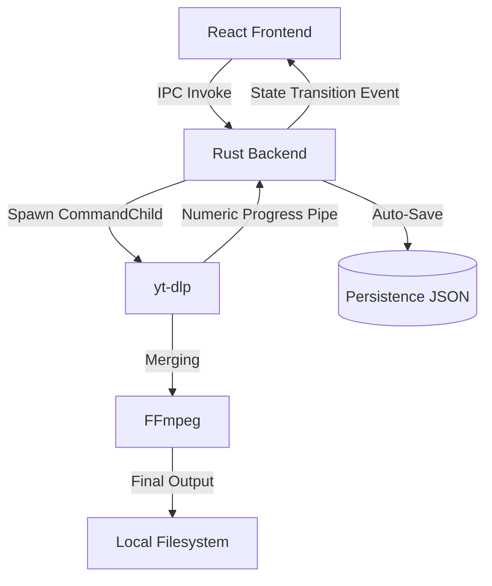

# VidFlow Architecture

This document details the technical implementation, security model, and operational constraints of VidFlow.

## System Overview

VidFlow is a cross-platform media downloader built on **Tauri**, providing a secure IPC boundary between a **React (TypeScript)** frontend and a **Rust** backend. It orchestrates `yt-dlp` and `ffmpeg` as managed child processes.



## Core Architectural Pillars

### 1. Authoritative State Machine (Backend-Enforced)
While the UI displays state, the **Rust backend is the system of record**. The `DownloadTask` struct implements a strict transition matrix.

| Source State | Target State | Trigger |
| :--- | :--- | :--- |
| `Queued` | `Preparing` | Queue worker promotion |
| `Queued` | `Cancelled` | User cancellation |
| `Preparing` | `Downloading` | Process spawn success |
| `Preparing` | `Error` | Spawn failure / Invalid URL |
| `Preparing` | `Cancelled` | User cancellation |
| `Downloading` | `Merging` | Merger stdout detection |
| `Downloading` | `Completed` | Process exit (Code 0 + Rigorous ffprobe pass) |
| `Downloading` | `Paused` | User pause |
| `Downloading` | `Cancelled` | User cancellation (Tree Kill) |
| `Downloading` | `Error` | Process Crash / Verification fail |
| `Paused` | `Downloading` | User resume |
| `Paused` | `Cancelled` | User cancellation (Cleanup) |
| `Merging` | `Completed` | Process exit (Code 0 + Rigorous ffprobe pass) |
| `Merging` | `Error` | Merge fail / Exit Code != 0 |
| `Merging` | `Cancelled` | User cancellation (Tree Kill) |
| **Terminal States** | | **Immutable (Manual Retry required)** |

### 2. Transactional Cancellation & Tree Kill
Cancellation is a principal-level hardening transaction:
1. **Tree Kill**: Uses platform-aware logic.
    - **Windows**: `taskkill /F /T /PID` ensure descendants (ffmpeg) are purged.
    - **POSIX**: Escalated `SIGTERM`.
2. **Verification**: Backend awaits the `Terminated` event from the OS.
3. **Atomic Purge**: Remove `.part` and `.ytdl` files only after process exit confirmation.
4. **State Finalization**: Notify UI of `Cancelled` status only after cleanup is complete.

### 3. Atomic Persistence & Schema Versioning
- **Atomic Writes**: Implements `write-to-tmp` -> `rename` pattern to prevent data corruption on crash.
- **Versioning**: Schema versioning (current v1) allows for safe future migrations.
- **Recovery Logic**: Any task found in a non-terminal state (`Downloading`, `Merging`, `Preparing`) is automatically transitioned to `Error` on boot to maintain UI integrity.
- **Structured Logging**: Uses `tauri-plugin-log` for centralized, rotatable logs stored in the OS-standard log directory.

**JSON Schema:**
```json
 {
  "tasks": [
    {
      "id": "uuid-v4",
      "url": "https://...",
      "title": "Video Title",
      "status": "completed | error | cancelled",
      "progress": 100.0,
      "download_dir": "/path/to/downloads"
    }
  ]
}
```
- **Recovery Logic**: On application boot, the backend reads the persistence file. Any task found in a non-terminal state (`Downloading`, `Merging`, `Preparing`) is automatically transitioned to `Error` with a "Crashed during processing" flag to maintain UI integrity.

## IPC & Communication Protocol

### Commands (Invoke)
- `start_download(url, title, options)`: Registers and queues a new task.
- `cancel_download(id)`: Initiates the cancellation transaction.
- `list_downloads()`: Fetches the current system-of-record state (Sync at startup).
- `get_video_metadata(url)`: Lightweight `yt-dlp -J --flat-playlist` call.

### Events (Emit)
- `download-progress`: Throttled payload containing numeric progress, speed (bps), ETA, and **IPC Version**.
- `binary-error`: Dispatched on startup if `yt-dlp` or `ffmpeg` are missing or outdated.

### Versioning
- **Persistence v1**: Atomic JSON schema.
- **IPC v1**: Guaranteed payload structure with version field for frontend compatibility checks.

## Performance Engineering

- **Numeric Progress Parsing**: Uses `--progress-template "%(progress.downloaded_bytes)s|%(progress.total_bytes)s|%(progress.speed)s|%(progress.eta)s"` to bypass fragile regex parsing.
- **Worker Pool**: Max 2 concurrent processes per session to minimize I/O wait times and disk head thrashing on legacy storage.
- **Fragment Threading**: Uses `-N 8` for concurrent HTTP fragment acquisition.

## Security Model

### Command Injection Prevention
Uses Tauri's `Command` API (vectorized arguments). No shell is spawned (`sh -c` is bypassed), making it immune to injection attacks.

### Path & Resource Safety
- **Sanitization**: Paths are normalized via `std::fs::canonicalize`.
- **Restricted Cleanup**: File deletion is restricted to known temporary fragments (`.part`, `.ytdl`).
- **Cookie Isolation**: Permission-restricted temporary files used for auth-gated downloads.
- **System Guardrails**: 
    - `MAX_PLAYLIST_ITEMS = 100`: Prevents memory exhaustion from malicious playlists.
    - `MAX_CONCURRENT_DOWNLOADS = 2`: I/O management.
    - **Post-Download Verification**: Rigorous `ffprobe` check for container validity and non-zero size before marking as `Completed`.
