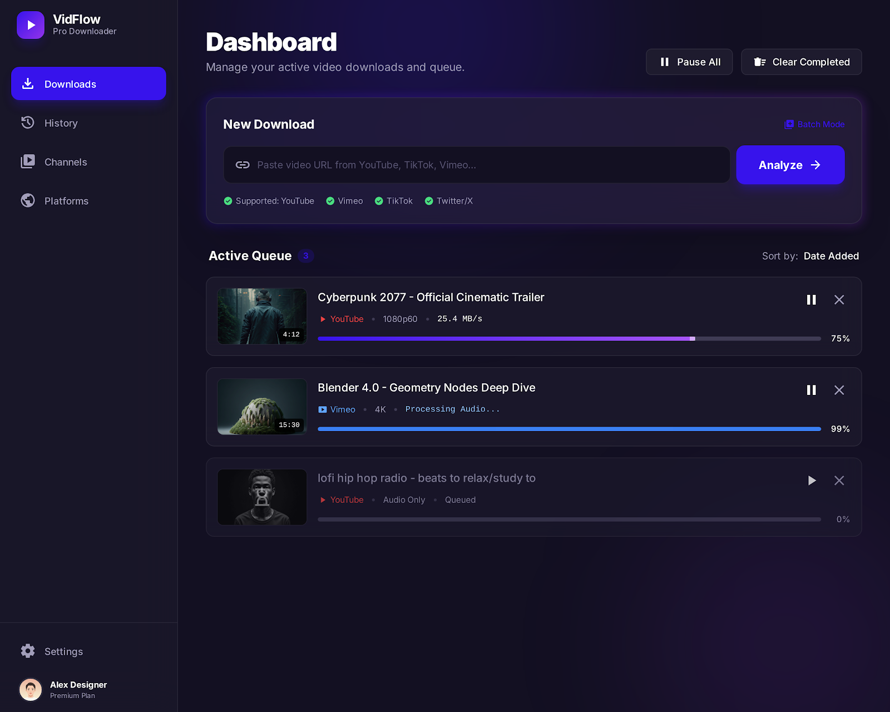
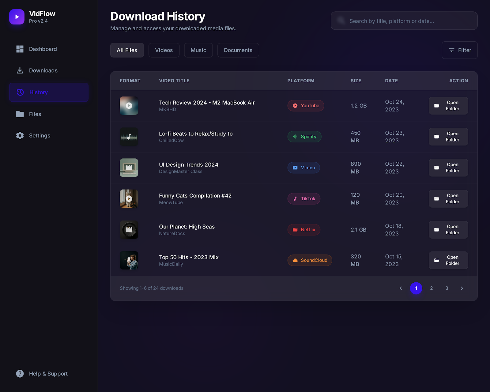

# 🌊 VidFlow

**The simplest way to download high-quality videos to your desktop.**

VidFlow is a clean and fast app that helps you save your favorite videos from the web so you can watch them offline, anytime. No complicated settings, no annoying ads, just the videos you love in the best quality possible.

---

## ✨ Why you'll love VidFlow

- **🚀 Really Fast**: We use smart technology to make sure your videos download as quickly as your internet allows.
- **🎨 Beautiful & Simple**: A modern design that is easy on the eyes and even easier to use.
- **💎 High Quality**: Supports everything up to 4K resolution, so your videos look crisp and clear.
- **🔒 Private & Secure**: VidFlow runs entirely on your computer. We don't track you or show you ads.
- **🌍 Works Everywhere**: Whether you use Windows, a Mac, or Linux, VidFlow has you covered.

---

## 📖 How to Use VidFlow (Step-by-Step)

Using VidFlow is as easy as 1-2-3:

1.  **Copy a Link**: Find a video you want to download on the web and copy its web address (URL).
2.  **Paste in VidFlow**: Open VidFlow and paste the link into the download box.
3.  **Click Download**: Choose the quality you want and hit the download button. That's it! 

Your video will be saved to your computer, ready for you to watch.

---

## 📥 How to Get It

You can download the latest version of VidFlow from our **Releases** page:

👉 **[Download VidFlow here](https://github.com/safi892/alldownloader/releases)**

### 🖥️ Installation Instructions

#### Windows
1. Download `VidFlow_*_x64-setup.exe`
2. Double-click the downloaded file
3. Follow the installation wizard
4. VidFlow will appear in your Start Menu

**Note:** If Windows shows a "Windows protected your PC" warning, click "More info" and then "Run anyway".

#### macOS (Apple Mac)

**For Apple Silicon Macs (M1, M2, M3, M4):**
1. Download `VidFlow_*_aarch64.dmg`
2. Double-click the DMG file
3. Drag VidFlow to your Applications folder
4. Open VidFlow from Applications

**For Intel Macs:**
1. Download `VidFlow_*_x64.dmg`
2. Double-click the DMG file
3. Drag VidFlow to your Applications folder
4. Open VidFlow from Applications

**Note:** If macOS says "cannot be opened because the developer cannot be verified":
- Right-click on VidFlow in Applications
- Click "Open"
- Click "Open" again in the dialog
- This only needs to be done once

#### Linux

**Ubuntu/Debian:**
1. Download `VidFlow_*_amd64.deb`
2. Open Terminal
3. Run: `sudo dpkg -i VidFlow_*.deb`
4. Find VidFlow in your applications menu

**Other Linux Distributions:**
1. Download `VidFlow_*_amd64.AppImage`
2. Right-click the file → Properties → Permissions → Allow executing
3. Double-click to run

### 📦 Direct Download Links

- **Windows:** [⬇️ Download for Windows (.exe)](https://github.com/safi892/alldownloader/releases/download/v0.1.1/VidFlow_0.1.1_x64-setup.exe)
- **macOS (Apple Mac):**
    - [⬇️ Download for M1/M2/M3 Mac](https://github.com/safi892/alldownloader/releases/download/v0.1.1/VidFlow_0.1.1_aarch64.dmg)
    - [⬇️ Download for Intel Mac](https://github.com/safi892/alldownloader/releases/download/v0.1.1/VidFlow_0.1.1_x64.dmg)
- **Linux:**
    - [⬇️ Download for Ubuntu/Debian (.deb)](https://github.com/safi892/alldownloader/releases/download/v0.1.1/VidFlow_0.1.1_amd64.deb)
    - [⬇️ Download Universal Linux (.AppImage)](https://github.com/safi892/alldownloader/releases/download/v0.1.1/VidFlow_0.1.1_amd64.AppImage)

*Can't find your version? Check all [Release Assets](https://github.com/safi892/alldownloader/releases/tag/v0.1.1).*

---

## 🛠️ For Developers

If you are a programmer and want to see how VidFlow works or build it yourself:

### Prerequisites
You need **Node.js** and **Rust** installed on your machine. You also need `ffmpeg` and `yt-dlp` available in your system path.

### Setup
1.  Clone the repository.
2.  Run `npm install` to get the dependencies.
3.  Run `./setup-sidecars.sh` to download the required engines (yt-dlp/ffmpeg).
4.  Run `npm run tauri dev` to start the app in development mode.

For more technical details, check out [ARCHITECTURE.md](./ARCHITECTURE.md).

---

## ⚖️ A Quick Note (Legal)
VidFlow is for personal use only. Please make sure you have the right to download the videos you are saving and respect the rules of the websites you visit.

---

## 📄 License
VidFlow is free and open-source under the MIT License.
